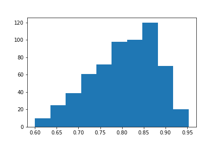

# Hackatal 2019 : équipe Karaoké

## Participants

- Adrien Bardet (@bardet_adrien)
- Nicolas Dugué (@nicolasdugue)
- Loïc Grobol (@evpokpadding)
- Victor Connes (@victorconnes)

# Défi 1 : Proposer des analyses sémantiques ou discursives des contributions du GDN

## Etude Embeddings -> Dossier EtudeEmbeddings

L'objectif est de comparer les représentations apprises sur un corpus dit "neutre", i.e. non connoté politiquement, le corpus frWac (wikipedia) avec des embeddings appris sur le corpus du grand débat national GDN). L'hypothèse, c'est que le contexte spécifique du GDN doit amener à des représentations très différentes de celle du corpus neutre, marquées par des contextes liés aux sujets du GDN mais également à l'époque dans laquelle s'ancre le GDN [#exemple]. Pour cela, nous considérons des embeddings qui sont préappris avec Word2vec sur le corpus frWac (wikipedia) et qui sont ceux disponibles en ligne sur le site de Jean-Philippe Fauconnier [https://fauconnier.github.io/#data]. Ils sont appris avec cbow et de dimension 700. Nous avons choisi des embeddings appris sur des lemmes.

Pour notre étude, nous conservons uniquement les catégories les plus porteuses de sens, i.e., les verbes, les noms, mais également les déterminants, adjectifs et interjections (qui peuvent servir à qualifier noms et verbes, et qui doivent par ailleurs être pour la plupart invariants d'un corpus à l'autre, ils offrent donc un point de comparaison).
Les étiquettes morpho-syntaxiques sont marquées ainsi : 
    
    manger_v
    pomme_n
    très_adv
    beau_a
    hé_i
    
Nous partons ensuite du corpus étiqueté morpho-syntaxiquement par Damien Nouvel [http://damien.nouvels.net/fr/debats2019]. Nous utilisons le fichier suivant :
    
    > head GDN.txt.tt 
    Afin	KON	afin
    d'	PRP	de
    éviter	VER:infi	éviter
    de	PRP	de
    creuser	VER:infi	creuser
    les	DET:ART	le
    inégalités	NOM	inégalité
    ne	ADV	ne
    plus	ADV	plus
    augmenter	VER:infi	augmenter
    
Nous conservons uniquement les POS qui nous intéressent :

    cat GDN.txt.tt | awk 'NF==3 {print}{}' | awk '/(VER.+|NOM|ADJ|ADV|INT|SENT)/' >> GDN_pos_filtered.txt.tt

Puis nous créons un fichier du grand débat phrase par phrase en utilisant uniquement les termes que nous considérons avec le fichier *lemme_to_txt.py* : le résultat est **GDN_pos_filtered.txt**.
Nous passons ensuite word2vec sur ce dernier pour obtenir nos embeddings, semblables à ceux de frWac.

Pour conserver uniquement les vecteurs communs aux deux corpus, nous utilisons *common_embeddings.py* : **frwac_common_sorted.txt** et **gdn_common_sorted.txt** en sont les résultats.
Afin de ne pas considérer dans la suite un vocabulaire trop large, et surtout des mots dont la fréquence est faible dans le corpus du grand débat, nous utilisons *distrib.py* pour calculer la fréquence de notre vocabulaire dans le fichier **GDN_pos_filtered.txt**. Le résultat est stocké dans **distribution_gdn_sorted.txt**.

### Exemples

#### Gilet GDN

	>>> from gensim.models import KeyedVectors
	>>> wv_from_text = KeyedVectors.load_word2vec_format('gdn_common_sorted.txt', binary=False)
	>>> wv_from_text.most_similar("gilet_n")
	[('jaune_a', 0.9214566946029663), ('jaune_n', 0.6313734650611877), ('enfiler_v', 0.5787583589553833), ('détonateur_n', 0.5656031370162964), ('jacquerie_n', 0.5498842000961304), ('pacifiste_a', 	0.5418269634246826), ('contestataire_n', 0.5362532734870911), ('étincelle_n', 0.5354418754577637), ('manif_n', 0.5342225432395935), ('chienlit_n', 0.5236349105834961)]

#### Gilet frWac

	>>> from gensim.models import KeyedVectors
	>>> wv_from_text = KeyedVectors.load_word2vec_format('frwac_common_sorted.txt'', binary=False)
	>>> wv_from_text.most_similar("gilet_n")
	[('veste_n', 0.7116566896438599), ('pantalon_n', 0.6993970274925232), ('pull_n', 0.6646631360054016), ('pare-balles_n', 0.6379226446151733), ('jupe_n', 0.6134262084960938), ('blouson_n', 		0.60909503698349), ('chemise_n', 0.5901532769203186), ('casquette_n', 0.5671770572662354), ('jupette_n', 0.5362040996551514), ('enfiler_v', 0.5351220369338989)]

#### Exemples intéressants

- manifester_v
- grenade_n
- gauche_n
- insoumis_a
- monarque_n
- évasion_n
- maçonnique_a
- fonctionnaire_n
- patriote_a
- laïcité_n
- féministe_a
- mariage_n
- famille_n

### Procruste

Afin de comparer les représentations pré-apprises sur le corpus wikipedia, et celles apprises sur le corpus du grand débat national (gdn), nous souhaitons tenter l'alignement des deux espaces via un procruste afin ensuite d'analyser les vecteurs qui divergent le plus une fois projetés dans le même espace.

Afin que l'alignement des deux espaces soit exploitable, il s'agit de n'aligner que du vocabulaire dont les représentations sont proches dans les deux corpus (wikipedia et gdn). Nous faisons l'hypothèse que c'est le cas pour les mots les plus fréquents, et nous réalisons donc l'alignement uniquement sur ce sous-ensemble du vocabulaire.

Nous exploitons donc les résultats données par *distrib.py* qui a calculé la fréquence de notre vocabulaire dans le fichier **GDN_pos_filtered.txt** et stocké le résultat dans **distribution_gdn_sorted.txt**. Nous utilisons ensuite **filter_matrix_for_procruste.py** afin de créer les fichiers *frwac_common_sorted_filtered.txt* et *gdn_common_sorted_filtered.txt* qui contiennent uniquement les vecteurs des mots présents plus de **500** fois dans le corpus du GDN : 

	$ wc -l frwac_common_sorted_filtered.txt 
	3105 frwac_common_sorted_filtered.txt

Le script crée également les fichiers *frwac_common_sorted_Uberfiltered.txt* et *gdn_common_sorted_Uberfiltered.txt* qui contiennent uniquement les vecteurs des mots présents plus de **5000** fois dans le corpus du GDN : 

	$ wc -l frwac_common_sorted_Uberfiltered.txt 
	615 frwac_common_sorted_Uberfiltered.txt
	
Enfin, le script crée les fichiers *frwac_common_sorted_Lowfiltered.txt* et *gdn_common_sorted_Lowfiltered.txt* qui contiennent uniquement les vecteurs des mots présents plus de **100** fois dans le corpus du GDN : 

	wc -l frwac_common_sorted_Lowfiltered.txt 
	6675 frwac_common_sorted_Lowfiltered.txt
	
Le procruste peut être appris par exemple sur la matrice *Uberfiltered* puis être exploité sur les matrices moins filtrées.

En appliquant le procruste sur les matrices *Uberfiltered*, on obtient une matrice de passage d'un espace vers l'autre : pour passer de l'espace de frwac vers l'espace gdn. Une fois cette matrice utilisée pour plonger tout le vocabulaire dans le même espace (gdn), on calcule les cosines entre les mots appris sur le corpus gdn, et les mots appris sur frwac et projetés dans l'espace gdn : 

*En abscisse la cosine entre les paires de mots identiques. En ordonnée, le nombre de valeurs de cette cosine.*

On constate que les valeurs de cosine sont relativement élevées et que la matrice de transformation donne donc de bons résultats.

Une fois appliqué sur une matrice plus grande, les mots qui ont la plus grande distance sont souvent très éloignés du sens initial : 

	>>> wv_from_text.most_similar("noir_n")
		[('gris_n', 0.660394549369812), ('dissimuler_v', 0.5514659881591797), ('fraude_n', 0.5211702585220337), 	('anthracite_a', 0.508368194103241), ('contrebande_n', 0.4985315501689911), ('triche_n', 0.478316068649292), 		('tricherie_n', 0.47249671816825867), ('dissimulation_n', 0.46892794966697693), ('assedic_n', 				0.4666924774646759), 	('pourchasser_v', 0.46498119831085205)]

	>>> wv_from_text.most_similar("casse_n")
	[('rebut_n', 0.47214385867118835), ('reboire_v', 0.4429307281970978), ('jupette_n', 0.4187106192111969), ('pare-balles_n', 0.40275681018829346), ('pneumatique_n', 0.3968466520309448), ('carrosserie_n', 0.3962632417678833), ('semonce_n', 0.395529180765152), ('cella_n', 0.3929745554924011), ('neuf_n', 0.38931623101234436), ('adaptateur_n', 0.3856121301651001)]
	
	>>> wv_from_text.most_similar("gouffre_n")
	[('ruineux_a', 0.42993730306625366), ('foireux_a', 0.42861253023147583), ('gabegie_n', 0.4239346385002136), ('gloriole_n', 0.4121926426887512), ('tonneau_n', 0.41163212060928345), ('notre-dame_n', 0.4110519289970398), ('fiasco_n', 0.40731561183929443), ('retardement_n', 0.40323159098625183), ('blinde_n', 0.4012852907180786), ('grandiose_a', 0.39928877353668213)]

	>>> wv_from_text.most_similar("celer_v")
	[('empois_n', 0.3745415508747101), ('bingo_n', 0.35250288248062134), ('pleure_n', 0.3525025248527527), ('sociolinguistique_a', 0.35015764832496643), ('redoutablement_adv', 0.34949833154678345), ('vertueusement_adv', 0.34830787777900696), ('exclamer_v', 0.34718388319015503), ('entre-temps_adv', 0.3467622399330139), ('déverrouiller_v', 0.3462890386581421), ('enchérir_v', 0.34553346037864685)]

	>>> wv_from_text.most_similar("dos_n")
	[('goinfrer_v', 0.4784447252750397), ('gaver_v', 0.4770304560661316), ('âne_n', 0.4549033045768738), ('engraisser_v', 0.44646206498146057), ('gave_n', 0.42493343353271484), ('graisser_v', 0.4203697443008423), ('politicard_n', 0.41065651178359985), ('putain_n', 0.4093102812767029), ('crémier_n', 0.4053325653076172), ('épinard_n', 0.4030919373035431)]
	
	>>> wv_from_text.most_similar("fin_a")
	[('particule_n', 0.6498943567276001), ('abrasion_n', 0.4861348271369934), ('oxyde_n', 0.47378477454185486), ('monoxyde_n', 0.4449079632759094), ('soufre_n', 0.4418048858642578), ('cynégétique_n', 0.4368818700313568), ('azote_n', 0.4353320002555847), ('suie_n', 0.43532419204711914), ('imbrûlé_n', 0.43424344062805176), ('urée_n', 0.433788001537323)]

	>>> wv_from_text.most_similar("inscrivant_n")
	[('sourd_n', 0.8313933610916138), ('lange_n', 0.7859182357788086), ('entendant_n', 0.7362926006317139), ('appareiller_v', 0.6244175434112549), ('celtique_a', 0.5904875993728638), ('signe_n', 0.5806676149368286), ('malentendant_n', 0.5707101225852966), ('avilir_v', 0.5691885352134705), ('roman_a', 0.5687268376350403), ('récrire_v', 0.5611604452133179)]
	
	>>> wv_from_text.most_similar("passe_n")
	[('inexpliqué_a', 0.4020499587059021), ('ripoux_n', 0.3987864851951599), ('moulinette_n', 0.389704167842865), ('foultitude_n', 0.3858844041824341), ('impudence_n', 0.38306063413619995), ('flinguer_v', 0.3815224766731262), ('déplier_v', 0.3813071548938751), ('tapir_v', 0.37958425283432007), ('toupet_n', 0.37840956449508667), ('violon_n', 0.37634986639022827)]

	>>> wv_from_text.most_similar("rond_a")
	[('rond-point_n', 0.6778731942176819), ('chicane_n', 0.562595009803772), ('âne_n', 0.5459263324737549), ('ralentisseur_n', 0.5195894837379456), ('carrefour_n', 0.5183433294296265), ('giratoire_n', 0.5121604204177856), ('boulodrome_n', 0.5087260007858276), ('giratoire_a', 0.5081877112388611), ('fleurissement_n', 0.5046559572219849), ('pavé_n', 0.49861809611320496)]
	
	>>> wv_from_text.most_similar("désert_n")
	[('désertification_n', 0.5461689829826355), ('ophtalmologiste_n', 0.5005236864089966), ('généraliste_a', 0.48566797375679016), ('dentiste_n', 0.48412513732910156), ('généraliste_n', 0.47808805108070374), ('kinésithérapeute_n', 0.46222472190856934), ('sage-femme_n', 0.4601808786392212), ('dermatologie_n', 0.45375484228134155), ('ophtalmologie_n', 0.4531075656414032), ('radiologie_n', 0.4523189961910248)]
	
	>>> wv_from_text.most_similar("passé_n")
	[('colonial_a', 0.40886175632476807), ('glorieux_a', 0.3953016996383667), ('après-guerre_n', 0.3910141587257385), ('démiurge_n', 0.38867777585983276), ('colonialiste_a', 0.3868556618690491), ('trente_n', 0.38136595487594604), ('rééditer_v', 0.3720390200614929), ('gaullien_a', 0.3715704679489136), ('relique_n', 0.3713180422782898), ('révolu_a', 0.36888670921325684)]

## Dépendances: 

 
* Convertvec: 	https://github.com/marekrei/convertvec  
* Moses :	https://github.com/moses-smt/mosesdecoder  
* NmtpyTorch:	https://github.com/lium-lst/nmtpytorch  
